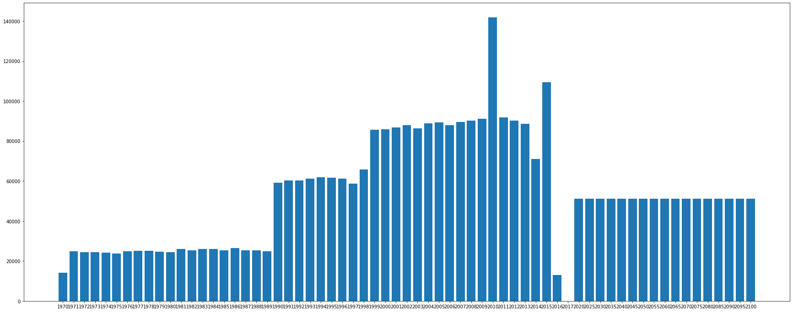

[https://openclassrooms.com/fr/paths/164/projects/627/assignment](https://openclassrooms.com/fr/paths/164/projects/627/assignment)


## Preamble


```python
import numpy as np # linear algebra
import pandas as pd # data processing, CSV file I/O (e.g. pd.read_csv)
import matplotlib.pyplot as plt
import seaborn as sns

%matplotlib inline
```


    ---------------------------------------------------------------------------

    ModuleNotFoundError                       Traceback (most recent call last)

    <ipython-input-95-07b60a456043> in <module>
          2 import pandas as pd # data processing, CSV file I/O (e.g. pd.read_csv)
          3 import matplotlib.pyplot as plt
    ----> 4 import seaborn as sns
          5 
          6 get_ipython().run_line_magic('matplotlib', 'inline')


    ModuleNotFoundError: No module named 'seaborn'


## Objectifs

Déterminer si les [données sur l’éducation de la banque mondiale](https://datacatalog.worldbank.org/dataset/education-statistics) permettent
d’informer le projet d’expansion de l'entreprise.

-   Quels sont les pays avec un fort potentiel de clients pour nos services ?
-   Pour chacun de ces pays, quelle sera l’évolution de ce potentiel de clients ?
-   Dans quels pays l'entreprise doit-elle opérer en priorité ?


## Analyse exploratoire

-   Valider la qualité de ce jeu de données (comporte-t-il beaucoup de données
    manquantes, dupliquées ?)
-   Décrire les informations contenues dans le jeu de données (nombre de colonnes
    ? nombre de lignes ?)
-   Sélectionner les informations qui semblent pertinentes pour répondre à la
    problématique (quelles sont les colonnes contenant des informations qui
    peuvent être utiles pour répondre à la problématique de l’entreprise ?)
-   Déterminer des ordres de grandeurs des indicateurs statistiques classiques
    pour les différentes zones géographiques et pays du monde
    (moyenne/médiane/écart-type par pays et par continent ou bloc géographique)


### Loading Data


```python
ed_sets = {'country_series': 'EdStatsCountry-Series.csv',
           'foot_note': 'EdStatsFootNote.csv',
           'country': 'EdStatsCountry.csv',
           'series': 'EdStatsSeries.csv',
           'data': 'EdStatsData.csv'}
```


```python
for key, val in ed_sets.items():
    exec("file = 'data/" + val + "'")
    exec(key + "= pd.read_csv(file)")
    print("--- " + val)
    exec("print(" + key + ".shape)")
    exec("print(" + key + ".isna().sum())")
```

    --- EdStatsCountry-Series.csv
    (613, 4)
    CountryCode      0
    SeriesCode       0
    DESCRIPTION      0
    Unnamed: 3     613
    dtype: int64
    --- EdStatsFootNote.csv
    (643638, 5)
    CountryCode         0
    SeriesCode          0
    Year                0
    DESCRIPTION         0
    Unnamed: 4     643638
    dtype: int64
    --- EdStatsCountry.csv
    (241, 32)
    Country Code                                           0
    Short Name                                             0
    Table Name                                             0
    Long Name                                              0
    2-alpha code                                           3
    Currency Unit                                         26
    Special Notes                                         96
    Region                                                27
    Income Group                                          27
    WB-2 code                                              1
    National accounts base year                           36
    National accounts reference year                     209
    SNA price valuation                                   44
    Lending category                                      97
    Other groups                                         183
    System of National Accounts                           26
    Alternative conversion factor                        194
    PPP survey year                                       96
    Balance of Payments Manual in use                     60
    External debt Reporting status                       117
    System of trade                                       41
    Government Accounting concept                         80
    IMF data dissemination standard                       60
    Latest population census                              28
    Latest household survey                              100
    Source of most recent Income and expenditure data     81
    Vital registration complete                          130
    Latest agricultural census                            99
    Latest industrial data                               134
    Latest trade data                                     56
    Latest water withdrawal data                          62
    Unnamed: 31                                          241
    dtype: int64
    --- EdStatsSeries.csv
    (3665, 21)
    Series Code                               0
    Topic                                     0
    Indicator Name                            0
    Short definition                       1509
    Long definition                           0
    Unit of measure                        3665
    Periodicity                            3566
    Base Period                            3351
    Other notes                            3113
    Aggregation method                     3618
    Limitations and exceptions             3651
    Notes from original source             3665
    General comments                       3651
    Source                                    0
    Statistical concept and methodology    3642
    Development relevance                  3662
    Related source links                   3450
    Other web links                        3665
    Related indicators                     3665
    License Type                           3665
    Unnamed: 20                            3665
    dtype: int64
    --- EdStatsData.csv
    (886930, 70)
    Country Name           0
    Country Code           0
    Indicator Name         0
    Indicator Code         0
    1970              814642
                       ...  
    2085              835494
    2090              835494
    2095              835494
    2100              835494
    Unnamed: 69       886930
    Length: 70, dtype: int64


-   We can safely remove the last column of all the datasets:


```python
del data['Unnamed: 69']
del series['Unnamed: 20']
del country['Unnamed: 31']
del foot_note['Unnamed: 4']
del country_series['Unnamed: 3']
```

-   Do we find every indicator from the series table in our main dataset ?


```python
print(len(data['Indicator Code'].unique()))
```

    3665


-   3665 indicators for 241 countries equals to 883 265, a little less than the
    886 930 rows of our main data. Do we have the same number of countries in the
    latter ?


```python
print(len(data['Country Code'].unique()))
```

    242


Which country is not referenced in the EdStatsCountry data set ?


```python
for i in list(set(data['Country Code'].unique()) - set(country['Country Code'].unique())):
      print(data.loc[data['Country Code'] == i])
```

                      Country Name Country Code  \
    190580  British Virgin Islands          VGB   
    190581  British Virgin Islands          VGB   
    190582  British Virgin Islands          VGB   
    190583  British Virgin Islands          VGB   
    190584  British Virgin Islands          VGB   
    ...                        ...          ...   
    194240  British Virgin Islands          VGB   
    194241  British Virgin Islands          VGB   
    194242  British Virgin Islands          VGB   
    194243  British Virgin Islands          VGB   
    194244  British Virgin Islands          VGB   
    
                                               Indicator Name  \
    190580  Adjusted net enrolment rate, lower secondary, ...   
    190581  Adjusted net enrolment rate, lower secondary, ...   
    190582  Adjusted net enrolment rate, lower secondary, ...   
    190583  Adjusted net enrolment rate, lower secondary, ...   
    190584  Adjusted net enrolment rate, primary, both sex...   
    ...                                                   ...   
    194240  Youth illiterate population, 15-24 years, male...   
    194241  Youth literacy rate, population 15-24 years, b...   
    194242  Youth literacy rate, population 15-24 years, f...   
    194243  Youth literacy rate, population 15-24 years, g...   
    194244  Youth literacy rate, population 15-24 years, m...   
    
                  Indicator Code  1970  1971  1972  1973  1974  1975  ...  2055  \
    190580            UIS.NERA.2   NaN   NaN   NaN   NaN   NaN   NaN  ...   NaN   
    190581          UIS.NERA.2.F   NaN   NaN   NaN   NaN   NaN   NaN  ...   NaN   
    190582        UIS.NERA.2.GPI   NaN   NaN   NaN   NaN   NaN   NaN  ...   NaN   
    190583          UIS.NERA.2.M   NaN   NaN   NaN   NaN   NaN   NaN  ...   NaN   
    190584           SE.PRM.TENR   NaN   NaN   NaN   NaN   NaN   NaN  ...   NaN   
    ...                      ...   ...   ...   ...   ...   ...   ...  ...   ...   
    194240      UIS.LP.AG15T24.M   NaN   NaN   NaN   NaN   NaN   NaN  ...   NaN   
    194241     SE.ADT.1524.LT.ZS   NaN   NaN   NaN   NaN   NaN   NaN  ...   NaN   
    194242  SE.ADT.1524.LT.FE.ZS   NaN   NaN   NaN   NaN   NaN   NaN  ...   NaN   
    194243  SE.ADT.1524.LT.FM.ZS   NaN   NaN   NaN   NaN   NaN   NaN  ...   NaN   
    194244  SE.ADT.1524.LT.MA.ZS   NaN   NaN   NaN   NaN   NaN   NaN  ...   NaN   
    
            2060  2065  2070  2075  2080  2085  2090  2095  2100  
    190580   NaN   NaN   NaN   NaN   NaN   NaN   NaN   NaN   NaN  
    190581   NaN   NaN   NaN   NaN   NaN   NaN   NaN   NaN   NaN  
    190582   NaN   NaN   NaN   NaN   NaN   NaN   NaN   NaN   NaN  
    190583   NaN   NaN   NaN   NaN   NaN   NaN   NaN   NaN   NaN  
    190584   NaN   NaN   NaN   NaN   NaN   NaN   NaN   NaN   NaN  
    ...      ...   ...   ...   ...   ...   ...   ...   ...   ...  
    194240   NaN   NaN   NaN   NaN   NaN   NaN   NaN   NaN   NaN  
    194241   NaN   NaN   NaN   NaN   NaN   NaN   NaN   NaN   NaN  
    194242   NaN   NaN   NaN   NaN   NaN   NaN   NaN   NaN   NaN  
    194243   NaN   NaN   NaN   NaN   NaN   NaN   NaN   NaN   NaN  
    194244   NaN   NaN   NaN   NaN   NaN   NaN   NaN   NaN   NaN  
    
    [3665 rows x 69 columns]


The British Virgin Islands are the one unidentified country that have data in the EdStatsData set.
As a british territory with only 30.000 inhabitants, it may not be pertinent to keep it in our study as with other such countries...

Some indicators are given by aggregate groups of countries. As we're looking for a country, we discard those indicators.


```python
for i in list(country[country['Region'].isnull()]['Country Code']):
    ids = data[data['Country Code'] == i].index
    data.drop(ids, inplace=True)
```

We will also discard countries that are provinces or islands with less than 100k inhabitants.


```python
pop = data[data['Indicator Name'] == 'Population, total'][['Country Name', '2015']]
excluded_countries = list(pop[pop['2015'] < 100000]['Country Name'])

for i in excluded_countries:
    ids = data[data['Country Name'] == i].index
    data.drop(ids, inplace=True)
```


```python
print(len(data['Country Code'].unique()))
```

    196


### Missing values

As we're a french company, we're looking for indicators available equally for france and our target country.


```python
france = data[data['Country Code'] == 'FRA']
indicators = france['Indicator Code'].unique()
years = france[france.columns[4:]]

# There is 3665 indicators
num_ind = years.shape[0]

# There is 65 columns of yearly data
num_years = years.shape[1]

# list of years
years = years.columns
```

Let's find indicators that are empty or poorly filled


```python
unusable_indicators = []

# filling rate
rate = 0.8
threshold = num_years - round(num_years * rate, 0)

for i in indicators:
    # non missing values by indicator (row)
    na_row = num_years - int(france[france['Indicator Code'] == i].isnull().sum(axis=1))
    if na_row <= threshold:
        unusable_indicators.append(i)
 
num_ind = num_ind - len(unusable_indicators)
print(num_ind)
```

    1000


From now on, we will use a subset of 1000 indicators.


```python
for i in unusable_indicators:
    ids = data[data['Indicator Code'] == i].index
    data.drop(ids, inplace=True)
```


```python
data.shape
```


    (196000, 69)


196 countries and 1000 indicators for 65 years.


```python
# non missing values by year (column)
na_cols = []
for i in years:
    na_cols.append((num_ind * 196) - int(data[i].isnull().sum(axis=0)))

plt.figure(figsize = (30,12))
plt.bar(years,na_cols)
plt.show()
```


    

    


Indicators are mostly availables for the years between 2000 and 2015. Some indicators are clearly cyclic (by a period of 5 years). Some indicators are consistently filled/forcasted from 2020 to 2100.

??? Do we need old data for our purpose ???

### Tactics

From the remaining data, which indicators are the most interesting to fullfill our mission ?


```python
print(data[data['Indicator Name'].str.contains('')]['Indicator Name'].unique())
```

    ['Gross enrolment ratio, lower secondary, both sexes (%)'
     'Gross enrolment ratio, lower secondary, female (%)'
     'Gross enrolment ratio, lower secondary, gender parity index (GPI)'
     'Gross enrolment ratio, lower secondary, male (%)'
     'Gross enrolment ratio, post-secondary non-tertiary, both sexes (%)'
     'Gross enrolment ratio, post-secondary non-tertiary, female (%)'
     'Gross enrolment ratio, post-secondary non-tertiary, gender parity index (GPI)'
     'Gross enrolment ratio, post-secondary non-tertiary, male (%)'
     'Gross enrolment ratio, pre-primary, both sexes (%)'
     'Gross enrolment ratio, pre-primary, female (%)'
     'Gross enrolment ratio, pre-primary, gender parity index (GPI)'
     'Gross enrolment ratio, pre-primary, male (%)'
     'Gross enrolment ratio, primary and lower secondary, both sexes (%)'
     'Gross enrolment ratio, primary and lower secondary, female (%)'
     'Gross enrolment ratio, primary and lower secondary, gender parity index (GPI)'
     'Gross enrolment ratio, primary and lower secondary, male (%)'
     'Gross enrolment ratio, primary and secondary, both sexes (%)'
     'Gross enrolment ratio, primary and secondary, female (%)'
     'Gross enrolment ratio, primary and secondary, gender parity index (GPI)'
     'Gross enrolment ratio, primary and secondary, male (%)'
     'Gross enrolment ratio, primary to tertiary, both sexes (%)'
     'Gross enrolment ratio, primary to tertiary, female (%)'
     'Gross enrolment ratio, primary to tertiary, gender parity index (GPI)'
     'Gross enrolment ratio, primary to tertiary, male (%)'
     'Gross enrolment ratio, primary, both sexes (%)'
     'Gross enrolment ratio, primary, female (%)'
     'Gross enrolment ratio, primary, gender parity index (GPI)'
     'Gross enrolment ratio, primary, male (%)'
     'Gross enrolment ratio, secondary, both sexes (%)'
     'Gross enrolment ratio, secondary, female (%)'
     'Gross enrolment ratio, secondary, gender parity index (GPI)'
     'Gross enrolment ratio, secondary, male (%)'
     'Gross enrolment ratio, tertiary, both sexes (%)'
     'Gross enrolment ratio, tertiary, female (%)'
     'Gross enrolment ratio, tertiary, gender parity index (GPI)'
     'Gross enrolment ratio, tertiary, male (%)'
     'Gross enrolment ratio, upper secondary, both sexes (%)'
     'Gross enrolment ratio, upper secondary, female (%)'
     'Gross enrolment ratio, upper secondary, gender parity index (GPI)'
     'Gross enrolment ratio, upper secondary, male (%)'
     'Gross graduation ratio from first degree programmes (ISCED 6 and 7) in tertiary education, both sexes (%)'
     'Gross graduation ratio from first degree programmes (ISCED 6 and 7) in tertiary education, female (%)'
     'Gross graduation ratio from first degree programmes (ISCED 6 and 7) in tertiary education, male (%)'
     'Gross intake ratio to Grade 1 of lower secondary general education, both sexes (%)'
     'Gross intake ratio to Grade 1 of primary education, both sexes (%)'
     'Gross outbound enrolment ratio, all regions, both sexes (%)']


```python
['Expenditure on education as % of total government expenditure (%)',
'Internet users (per 100 people)',
'Personal computers (per 100 people)',
'Population growth (annual %)',
'Population, total',
'Total outbound internationally mobile tertiary students studying abroad, all countries, both sexes (number)']
```


```python

```
